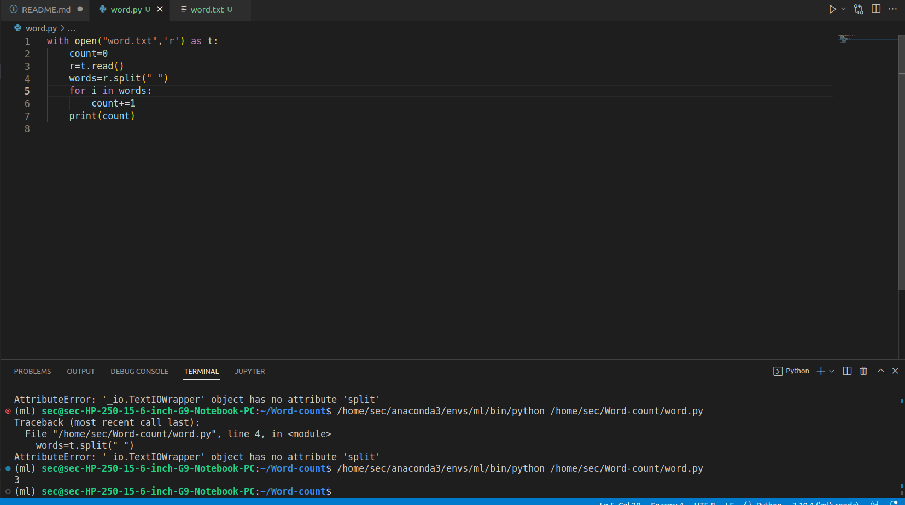

# Word-count
## AIM:
To write a python program for getting the word count from a text.
## EQUIPEMENT'S REQUIRED: 
PC
Anaconda - Python 3.7
## ALGORITHM: 
### Step 1:
create a text file
### Step 2: 
write a python code to open file
### Step 3: 
read the file
### Step 4:  
run the python code and add the output
## PROGRAM:
```
'''
name: HARISH RAGAVENDRA S
reference numbver: 22008967
'''
with open("word.txt",'r') as t:
    count=0
    r=t.read()
    words=r.split(" ")
    for i in words:
        count+=1
    print(count)

```
### OUTPUT:

## RESULT:
Thus the program is written to find the word count from a text.
